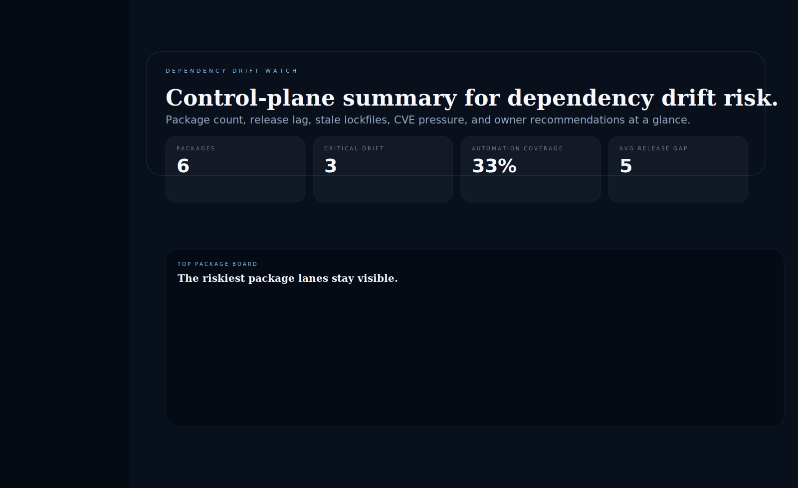
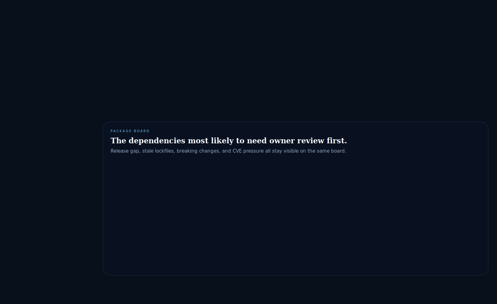
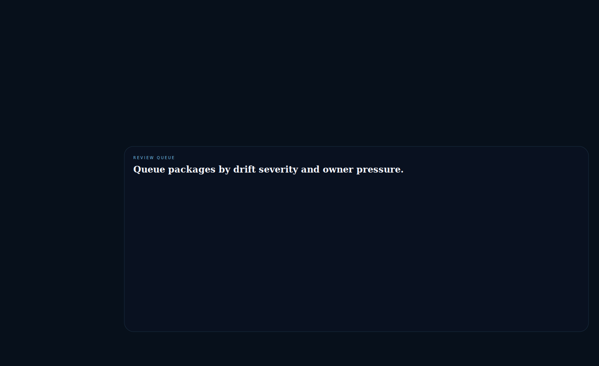
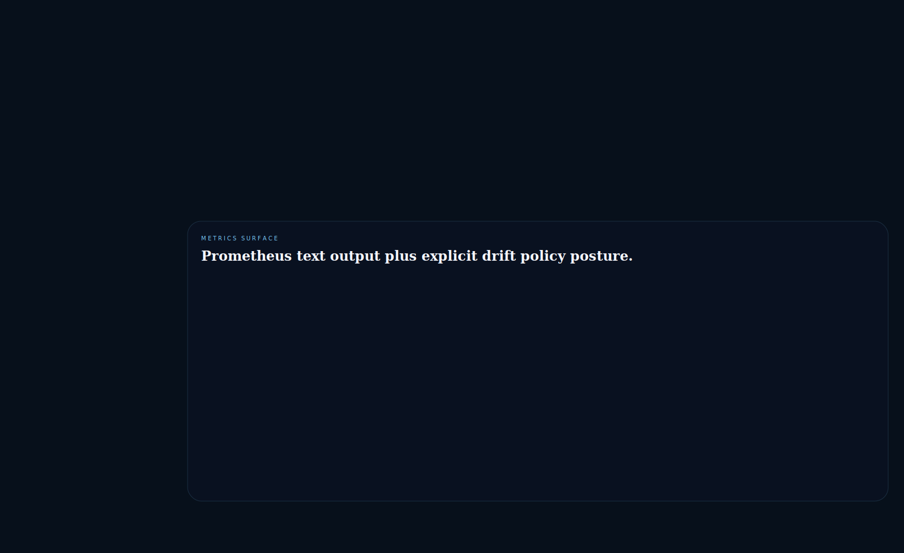
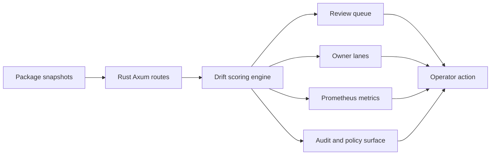

# Dependency Drift Watch

Rust and Axum control surface for **package drift, release lag, stale lockfiles, CVE pressure, and owner-lane review prioritization**.

> **What this repo proves**
>
> Dependency freshness becomes useful only when operators can see which packages are drifting, why they are risky, and which owner lane should move next.

## Why this repo exists

Platform teams usually have some combination of lockfiles, Dependabot, and patch notes. What they often do not have is a clean reliability surface that turns package lag into a readable queue:

- which packages are too far behind the current release line
- which stale lockfiles are hiding transitive risk
- which major-version jumps deserve human review instead of blind automation
- which owner lanes are letting drift stack up across critical services

`dependency-drift-watch` models that review layer directly. It treats dependency freshness as a platform-reliability and release-governance concern, not just a background automation task.

## Screenshots






## What it includes

- Rust + Axum service with HTML proof surfaces and JSON APIs
- modeled package fleet across Python, Rust, Node, and Java lanes
- drift scoring for release gap, lockfile age, CVE pressure, breaking changes, automation coverage, and service tier
- owner-lane review surface for package stewardship
- Prometheus-compatible `/metrics` endpoint
- policy configuration and audit/evidence surface for scan events and review recommendations
- screenshot generator, docs, origin story, changelog, tests, and CI

## Local run

```powershell
cd dependency-drift-watch
$env:Path = "$env:USERPROFILE\\.cargo\\bin;$env:Path"
cargo run
```

Then open:

- `http://127.0.0.1:5048/`
- `http://127.0.0.1:5048/packages`
- `http://127.0.0.1:5048/review-queue`
- `http://127.0.0.1:5048/owners`
- `http://127.0.0.1:5048/metrics-preview`
- `http://127.0.0.1:5048/docs`

If that port is busy:

```powershell
$env:PORT = "5052"
cargo run
```

## Validation

```powershell
cd dependency-drift-watch
$env:Path = "$env:USERPROFILE\\.cargo\\bin;$env:Path"
cargo test
cargo build
python scripts\\generate_screenshots.py
```

## API routes

- `GET /api/dashboard/summary`
- `GET /api/packages`
- `GET /api/packages/{id}`
- `GET /api/review-queue`
- `GET /api/owners`
- `GET /api/policy`
- `GET /api/audit`
- `GET /api/sample`
- `GET /metrics`

## Architecture



More detail lives in [docs/architecture.md](./docs/architecture.md).
